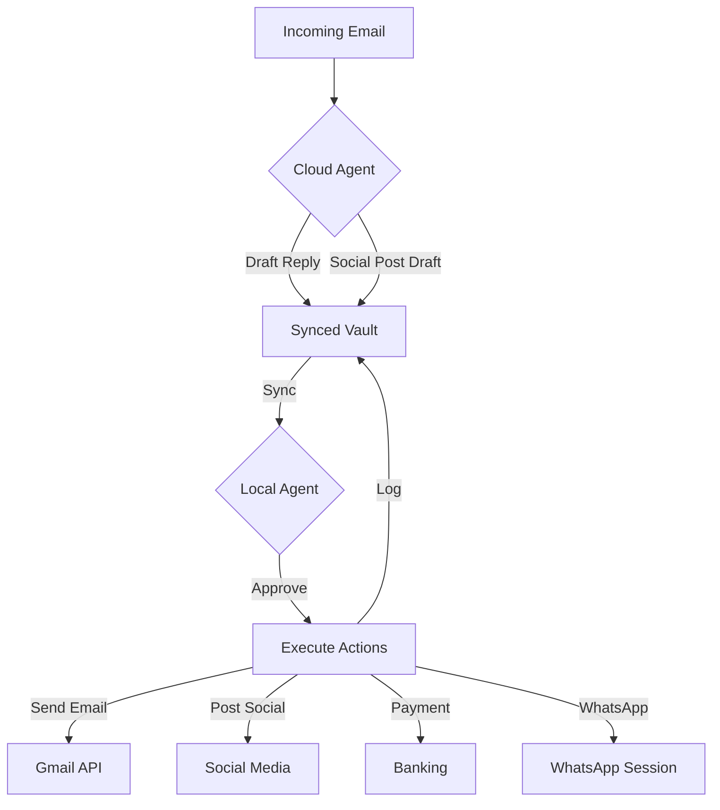

# Cloud Deployment Architect

> [!IMPORTANT]
> This skill guides the transition from Gold Tier (local-only) to Platinum Tier (cloud + local hybrid) operations. It implements the "Always-On Cloud + Local Executive" architecture from the hackathon guide.

## Core Philosophy
**"Cloud for triage, local for trust."** The cloud agent handles high-volume, low-risk tasks 24/7. The local agent handles sensitive operations requiring human oversight. Together, they form a complete autonomous system.

---

## Platinum Tier Architecture

### Work-Zone Specialization



### Responsibility Matrix

| Task Type | Cloud Agent | Local Agent | Reason |
|-----------|-------------|-------------|---------|
| Email triage | ✅ Draft | ✅ Approve & Send | Cloud can read, local has credentials |
| Social posts | ✅ Draft | ✅ Approve & Post | Cloud creates, local posts |
| Invoice drafts | ✅ Create | ✅ Approve & Post | Cloud has Odoo read, local has write |
| Payments | ❌ No access | ✅ Full control | Security: local-only credentials |
| WhatsApp | ❌ No session | ✅ Full control | Session tied to local machine |
| CEO Audit | ✅ Generate | ✅ Review | Cloud has data, local has context |

---

## Implementation Phases

### Phase 1: Vault Synchronization (Foundation)

**Goal:** Enable cloud and local agents to communicate via shared vault.

**Implementation:**

```bash
# On Local Machine
cd /path/to/vault
git init
git add .
git commit -m "Initial vault state"

# Create private GitHub repo
gh repo create digital-fte-vault --private
git remote add origin https://github.com/yourusername/digital-fte-vault.git
git push -u origin main

# Setup auto-sync (every 5 minutes)
crontab -e
# Add: */5 * * * * cd /path/to/vault && git pull && git add -A && git commit -m "Auto-sync" && git push
```

**On Cloud VM:**

```bash
# Clone vault
git clone https://github.com/yourusername/digital-fte-vault.git
cd digital-fte-vault

# Setup auto-sync
crontab -e
# Add: */5 * * * * cd /path/to/vault && git pull && git add -A && git commit -m "Cloud sync" && git push
```

**Security Rules:**
- `.gitignore` MUST include: `.env`, `credentials.json`, `token.pickle`, `whatsapp_session/`
- Cloud NEVER has access to payment credentials
- Local ALWAYS has final approval authority

---

### Phase 2: Cloud VM Setup (Oracle Free Tier)

**Oracle Cloud Free Tier Specs:**
- 2 AMD VMs: 1 OCPU, 1GB RAM each (or 1 ARM VM: 4 OCPUs, 24GB RAM)
- 200GB block storage
- 10TB outbound data transfer/month
- **Cost: $0/month**

**Setup Steps:**

```bash
# 1. Create Oracle Cloud account
# https://www.oracle.com/cloud/free/

# 2. Create VM instance
# - Shape: VM.Standard.A1.Flex (ARM, 4 OCPUs, 24GB RAM)
# - OS: Ubuntu 22.04
# - Boot volume: 50GB

# 3. SSH into VM
ssh ubuntu@<vm-public-ip>

# 4. Install dependencies
sudo apt update && sudo apt upgrade -y
sudo apt install -y python3.13 python3-pip git nodejs npm

# 5. Clone project
git clone https://github.com/yourusername/digital-fte-vault.git
cd digital-fte-vault

# 6. Install Python dependencies
pip3 install -r requirements.txt

# 7. Setup environment (NO SENSITIVE CREDENTIALS)
cat > .env << EOF
GEMINI_API_KEY=your_key_here
NTFY_TOPIC=kashan_sentinel_cloud
# NO GMAIL CREDENTIALS
# NO WHATSAPP SESSION
# NO BANKING CREDENTIALS
EOF

# 8. Setup systemd services for watchers
sudo nano /etc/systemd/system/gmail-watcher.service
```

**Systemd Service Template:**

```ini
[Unit]
Description=Gmail Watcher (Cloud)
After=network.target

[Service]
Type=simple
User=ubuntu
WorkingDirectory=/home/ubuntu/digital-fte-vault
ExecStart=/usr/bin/python3 gmail_watcher.py --cloud-mode
Restart=always
RestartSec=10

[Install]
WantedBy=multi-user.target
```

```bash
# Enable and start services
sudo systemctl enable gmail-watcher
sudo systemctl start gmail-watcher
sudo systemctl status gmail-watcher
```

---

### Phase 3: Claim-by-Move Rule Implementation

**Problem:** Both cloud and local agents might try to process the same task.

**Solution:** First agent to move task from `/Needs_Action` to `/In_Progress/<agent>/` owns it.

**Implementation:**

```python
# In orchestrator.py (both cloud and local)

import fcntl
from pathlib import Path

def claim_task(task_file: Path, agent_name: str) -> bool:
    """
    Atomically claim a task by moving it to In_Progress/<agent>/.
    Returns True if claim successful, False if another agent claimed it.
    """
    in_progress_dir = BASE_DIR / "In_Progress" / agent_name
    in_progress_dir.mkdir(parents=True, exist_ok=True)
    
    dest_file = in_progress_dir / task_file.name
    
    try:
        # Atomic move (fails if file already moved)
        task_file.rename(dest_file)
        return True
    except FileNotFoundError:
        # Another agent already claimed it
        return False

# Usage in orchestrator
for task_file in NEEDS_ACTION.glob("*.md"):
    if claim_task(task_file, "cloud" if IS_CLOUD else "local"):
        process_task(task_file)
    else:
        logger.info(f"Task {task_file.name} already claimed by other agent")
```

---

### Phase 4: Cloud-Specific Workflows

**Cloud Agent Capabilities:**

1. **Email Triage (Draft-Only)**
```python
# gmail_watcher.py --cloud-mode

def process_email_cloud(email_data):
    """Cloud agent creates draft reply, not send"""
    # 1. Analyze email with Claude
    draft_reply = generate_reply_with_claude(email_data)
    
    # 2. Create approval request (NOT in Gmail, in vault)
    approval_file = PENDING / f"EMAIL_DRAFT_{email_id}.md"
    approval_file.write_text(f"""
---
type: email_draft
from_cloud: true
requires_local_approval: true
---

# Email Draft for Approval

**To:** {email_data['to']}
**Subject:** {email_data['subject']}

## Draft Reply
{draft_reply}

## Action Required (Local Agent)
Move to `03_Approved/` to send via Gmail API.
""")
    
    # 3. Commit to vault (local will sync and review)
    subprocess.run(["git", "add", str(approval_file)])
    subprocess.run(["git", "commit", "-m", f"Cloud: Email draft for {email_id}"])
    subprocess.run(["git", "push"])
```

2. **Social Media Scheduling (Draft-Only)**
```python
# social_media_scheduler.py --cloud-mode

def schedule_social_post_cloud(content):
    """Cloud creates post draft, local posts"""
    # Generate platform-optimized versions
    fb_draft = optimize_for_facebook(content)
    twitter_draft = optimize_for_twitter(content)
    ig_draft = optimize_for_instagram(content)
    
    # Save drafts for local approval
    for platform, draft in [("FB", fb_draft), ("X", twitter_draft), ("IG", ig_draft)]:
        draft_file = PENDING / f"P1_{platform}_{timestamp}.md"
        draft_file.write_text(draft)
    
    # Sync to vault
    git_commit_and_push("Cloud: Social media drafts created")
```

3. **Odoo Invoice Drafts (Read-Only)**
```python
# odoo_mcp_server.py --cloud-mode

# Cloud has READ-ONLY Odoo access
# Can create invoice drafts, cannot post
# Local has WRITE access, can post after approval
```

---

### Phase 5: Local Agent Enhancements

**Local Agent Responsibilities:**

1. **Approval Processing**
```python
# approval_processor.py (local-only)

def process_approvals():
    """Local agent reviews cloud-created drafts"""
    for approval_file in PENDING.glob("*.md"):
        # Parse approval request
        metadata = parse_frontmatter(approval_file)
        
        if metadata.get("from_cloud"):
            # Cloud-created draft, needs local review
            print(f"Cloud draft ready for review: {approval_file.name}")
            # Human reviews and moves to APPROVED
            
        if approval_file in APPROVED:
            # Execute approved action
            execute_approved_action(approval_file)
```

2. **Sensitive Action Execution**
```python
# Only local agent can:
# - Send emails (has Gmail credentials)
# - Post to social media (has API tokens)
# - Make payments (has banking credentials)
# - Send WhatsApp (has session)
```

---

## Monitoring & Health Checks

### Cloud Monitoring

```python
# health_monitor.py (runs on cloud)

import requests
from datetime import datetime

def send_health_ping():
    """Ping ntfy.sh to confirm cloud agent is alive"""
    requests.post(
        "https://ntfy.sh/kashan_sentinel_cloud",
        data=f"Cloud agent healthy at {datetime.now()}",
        headers={"Priority": "low"}
    )

# Run every 15 minutes
# If local doesn't receive ping for 30 min, alert
```

### Local Monitoring

```python
# watchdog_platinum.py (runs on local)

def check_cloud_health():
    """Verify cloud agent is responsive"""
    last_commit = get_last_git_commit_time()
    
    if (datetime.now() - last_commit).seconds > 1800:  # 30 min
        alert_user("Cloud agent may be down - no commits in 30 min")
```

---

## Cost Analysis

### Oracle Cloud Free Tier (Platinum)
- **Compute:** $0 (Free tier)
- **Storage:** $0 (200GB included)
- **Network:** $0 (10TB outbound/month)
- **Total:** $0/month

### API Costs (Platinum)
- **Gemini API (Cloud):** ~$30/month (high volume)
- **Gemini API (Local):** ~$20/month (approvals only)
- **Total:** ~$50/month

### Total Cost of Ownership
- **Gold Tier (Local only):** $20-30/month
- **Platinum Tier (Cloud + Local):** $50/month
- **Human VA:** $2,000/month
- **Savings:** 97.5%

---

## Deployment Checklist

### Pre-Deployment
- [ ] Oracle Cloud account created
- [ ] VM instance provisioned
- [ ] Git repository setup (private)
- [ ] `.gitignore` configured (no secrets)
- [ ] Local vault syncing to Git

### Cloud Setup
- [ ] Dependencies installed on VM
- [ ] Watchers running as systemd services
- [ ] Health monitoring active
- [ ] Logs configured
- [ ] Firewall rules set

### Local Setup
- [ ] Vault syncing from Git
- [ ] Approval processor running
- [ ] Sensitive credentials secured
- [ ] WhatsApp session active
- [ ] Payment systems configured

### Testing
- [ ] End-to-end email workflow (cloud draft → local send)
- [ ] Social media workflow (cloud draft → local post)
- [ ] Odoo workflow (cloud invoice → local post)
- [ ] Claim-by-move rule tested
- [ ] Failure scenarios tested

---

## Platinum Tier Demo Script

**For Hackathon Judges:**

```markdown
## Platinum Tier Demonstration (5 minutes)

### Setup (30 seconds)
- Show Oracle Cloud VM running (free tier)
- Show local machine running
- Show Git vault syncing between them

### Act 1: Cloud Triage (90 seconds)
- Send test email to Gmail
- Cloud watcher detects (show logs on VM)
- Cloud agent drafts reply with Claude
- Draft committed to Git vault
- Show approval file in `/Pending_Approval`

### Act 2: Local Approval (60 seconds)
- Local machine syncs vault (show git pull)
- Human reviews draft
- Move to `/Approved`
- Local agent executes send
- Email sent via Gmail API

### Act 3: Work-Zone Separation (60 seconds)
- Trigger payment request
- Cloud agent: NO ACCESS (show security)
- Local agent: FULL CONTROL (show execution)
- Demonstrate security boundary

### Act 4: The Proof (30 seconds)
- Show 24/7 uptime (cloud never sleeps)
- Show cost: $0 cloud + $50 API = $50/month total
- Show audit trail across both agents
```

---

**Remember:** Platinum Tier is about **scale** (24/7 cloud) and **security** (local-only sensitive ops). The cloud agent is your tireless worker; the local agent is your trusted executive.

---

*This skill enables true 24/7 autonomous operations with enterprise-grade security.*
